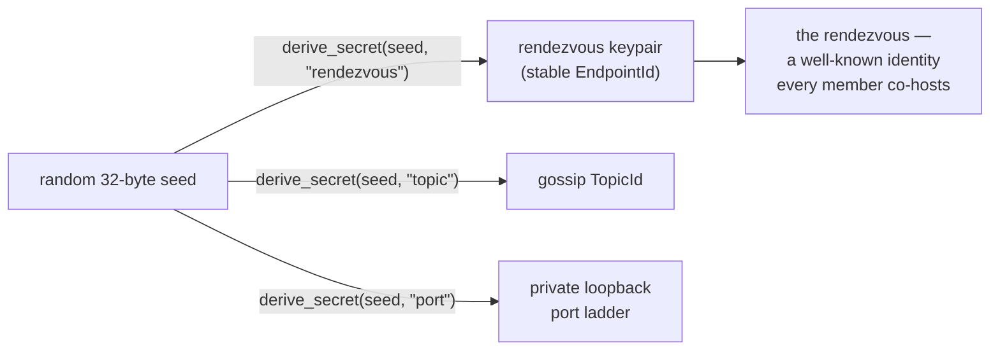
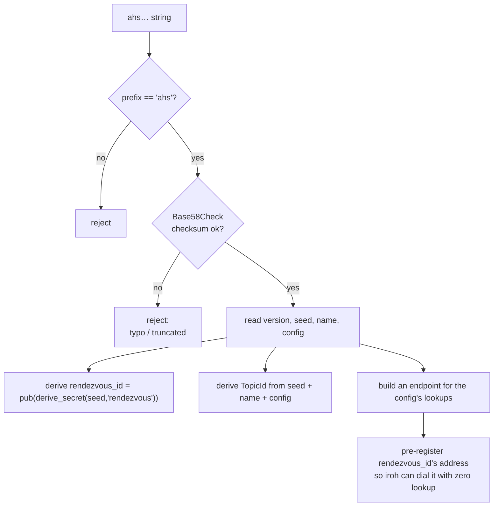
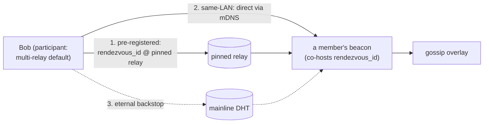

# How peers find each other

`agent-habilis-swarm` has no server, no account, and no central
registry. Pasting one `ahs…` string into a second machine connects the
two processes. This document describes that process step by step.

[`gossip.md`](./gossip.md) covers what happens *after* peers are
connected: the HyParView/Plumtree overlay that relays messages. This
document covers the layer below it — how two machines that have never
exchanged a packet locate and reach each other, and how they recover
when the network drops.

Two participants are used throughout: **Alice** runs `create`; **Bob**
runs `join`. Note up front: nothing below makes Alice special. The
swarm is **creator-independent** — Alice can quit and the swarm keeps
working, because identity is derived from a shared seed, not from
Alice.

---

## 1. The problem

Bob's machine has no prior knowledge of Alice's machine. There is no
tracker and no `agent-habilis-swarm.com` to query. Both may be behind
home routers that drop unsolicited inbound packets (NAT). From the
`ahs…` string alone Bob must derive:

1. **Who** to look for — a stable cryptographic identity, not an IP
   that changes every reconnect, and not tied to whoever happens to
   have created the swarm.
2. **How to reach** it — a path through NAT, or a fallback.
3. **Which conversation** to join, so two unrelated swarms never mix.

The `ahs…` id encodes none of those directly. It encodes a single
**random seed**; everything else is *derived* from it locally, the
same way, on every machine.

---

## 2. The `ahs…` id is a seed, not an address

When Alice runs `create`, her daemon generates **32 random bytes** —
the `seed` — and packs them with the swarm name and config (rate limit
+ lookups). It does **not** put any address or key in the id.



Every derivation is a domain-separated SHA-256:
`derive_secret(seed, label) = SHA256("agent-habilis-swarm/v2" ‖ len(label) ‖
label ‖ seed)`. Distinct labels (`rendezvous`, `topic`, `port`) can
never collide for one seed. Bob, decoding the same `ahs…`, runs the
exact same derivations and gets the exact same rendezvous identity and
topic — **without contacting Alice**.

This is why the id is *eternal* and *creator-independent*: it contains
no expiring address and names no particular machine. An id minted
today still works in a year, as long as any member is online.

(`src/protocol/crypto.rs`: `derive_secret`, `rendezvous_secret`/`rendezvous_id`,
`rendezvous_ports`, `derive_topic_id`.)

---

## 3. Anatomy of an `ahs…` id

The id carries a random `seed`, the swarm `name`, and the swarm's
config (rate limit + the `mdns`/`dht`/`relay` lookups) — no key, no IP.
There is **no peer address stored anywhere**, and a forged id with any
tampered field hashes to a *different* topic (see §6) and simply finds
no peers.

The full byte layout, the config encoding, and the Base58Check framing
live in **[`docs/swarm-hash.md`](swarm-hash.md)** — the single source of
truth for the id format. This doc covers what happens *after* an id is
decoded.

(`src/protocol/swarm/mod.rs`: `Swarm::encode_bytes`/`decode_bytes`,
`base58check_encode`.)

---

## 4. Bob decodes, then derives — no network yet

`join ahs…` parses the string and locally derives the swarm's
identity. Still zero packets sent:



The last step is the key to fast bootstrap. Bob constructs an
`EndpointAddr` for the **rendezvous** (its derived id + the relay it is
known to home on, §5) and registers it. iroh now has a concrete path
to the rendezvous before any discovery query runs — a creator-independent
bootstrap with zero address-lookup wait.

(`src/protocol/swarm/mod.rs` decode; `register_rendezvous` +
`add_peer_addr` in `src/daemon/setup.rs` / `src/lookup/mod.rs`.)

---

## 5. Reaching the rendezvous

Nobody connects to "Alice". Bob connects to the **rendezvous**: the
seed-derived identity that *every live member co-hosts*. Whoever
currently holds it bridges Bob into the mesh; if that member dies,
another already co-hosts the same identity. This co-host role is the
**beacon** (`src/beacon/mod.rs`).

How the rendezvous is reached depends entirely on the swarm's
**lookups**, which the id carries (so every member agrees):

### Loopback only — no lookups

With an empty lookup set the endpoint binds `127.0.0.1`, with
`RelayMode::Disabled` and the portmapper disabled — **zero non-loopback
packets**. The rendezvous has no DNS/relay to resolve, so instead the
seed derives a deterministic **loopback port ladder**
(`derive_secret(seed,"port")`, 8 rungs). Exactly one member is the beacon: it
binds the first free rung; `AddrInUse` triggers an identity probe
distinguishing *our* beacon (stay a participant) from an unrelated swarm
that derived the same port (skip to the next rung). Only other processes
on the machine can join. (`src/lookup/mod.rs` loopback branch;
`src/beacon/mod.rs` claim-if-free.)

### Reachable across machines — `--public` (the all-on lookup preset)



The asymmetry matters:

- The **beacon** *must* be findable, so it homes on **one
  deterministic relay**: a single hard-pinned default
  (`RENDEZVOUS_RELAY`, iroh's prod NA-east) — or the custom `--relay`
  if given. Bob pre-registered exactly that address in §4, so the
  first dial is relay-direct with **zero lookup**.
- The **participant** endpoint (Bob's own data endpoint) instead uses
  iroh's resilient **multi-relay default** (nearest of several, with
  fallback). Pinning *it* to one relay made `bind()` block on that
  single relay's handshake and removed iroh's relay fallback; a
  default participant still reaches the beacon at its pinned relay,
  and skips relays entirely on a LAN via mDNS.
- Two **address-lookups** are wired (publish + resolve
  `rendezvous_id`): **mDNS** (LAN multicast — instant, infra-free,
  the same-machine/same-LAN fast path) and the **mainline BitTorrent
  DHT** (operator-free, ~20-year track record — the *eternal*
  backstop if the pinned relay is ever retired). The pinned relay is the
  fast path and the DHT is the durable one.

The lookups are a create-time choice **baked into the id**, so a joiner
inherits them (no flags on `join`). On `create`, `--relay {URL}`
overrides the pinned default and `--mdns` / `--dht` are a presence
allowlist: naming none with `--public` enables all three; naming any
restricts to those. Because the lookups are mixed into the topic
(see §6), every member of a swarm necessarily uses the same set. See
[`swarm-hash.md`](swarm-hash.md).

(`src/lookup/mod.rs` `build_endpoint`; `src/protocol/swarm/lookup.rs`
`resolve_lookups`.)

A relayed hop is still end-to-end QUIC-encrypted — the relay forwards
ciphertext and cannot read bodies, but can observe that two endpoints
talk and when. Hole-punched/direct links expose nothing to a relay.
Privacy details: [security.md](./security.md).

---

## 6. The topic, and "breaking" it

A relay (and the DHT) carry many unrelated swarms, so Bob must join
*this* conversation. Every swarm has a 32-byte **TopicId**, derived —
not random:

```
TopicId = SHA256( derive_secret(seed, "topic")  ‖  len(name)  ‖  name  ‖  len(config)  ‖  config )
```

Both Alice (`create`) and Bob (`join`) compute it independently from
the seed, name, and config in the id. Identical inputs → identical topic
→ same conversation. Because the config (rate limit + lookups) is mixed
in, two members meet only if their entire config matches — so it cannot
diverge across a swarm. The seed runs through the domain-separated `derive_secret` first,
so the same 32 bytes can never be both the topic and the rendezvous
key. (`derive_topic_id` in `src/protocol/crypto.rs`.)

**Attack A: forge the name.** Edit the name bytes of a working `ahs…`
and recompute the Base58 checksum (trivial). It decodes — but the name
is hashed into the topic, so a different name yields a different
`TopicId`: the attacker lands in an empty topic with no peers. The
name is **cryptographically bound** to the swarm. (Pinned by
`different_names_produce_different_topics` /
`name_is_case_sensitive` in `src/protocol/crypto.rs`.)

**Attack B: guess the topic.** Reaching a swarm without its id means
computing the topic directly — a SHA-256 pre-image over a 256-bit
random seed. Not brute-forceable.

**What it does not do:** the `ahs…` id is a **bearer capability** —
anyone who has the string can join. The hash binds the name to the
seed so the id cannot be tampered into a *different* swarm; it is not
access control and not message encryption. Treat the id as a secret
if the swarm is meant to be private to a group. The practical risk is
id leakage, not breaking SHA-256. (Confidentiality, spoofable
nicknames, retention: [security.md](./security.md).)

---

## 7. Joining without an `ahs…` string: domains & repos

To avoid typing an 80-character id, `join` also accepts a domain or a
git repo and resolves it to an id over HTTPS:

```mermaid
flowchart TB
    I["join input"]
    I --> P{"looks like an<br/>ahs… id?"}
    P -->|yes| T["use it directly"]
    P -->|no| Q{"github.com/u/r ?<br/>gitlab.com/... ?<br/>bitbucket.org/... ?"}
    Q -->|git host| Gf["fetch raw .well-known<br/>file from the repo"]
    Q -->|plain domain| H["GET https://domain/<br/>.well-known/agent-habilis-swarm"]
    Gf --> J["parse { \"as.swarm\": \"ahs…\" }"]
    H --> J
    J --> T
```

A plain domain is fetched at
`https://domain/.well-known/agent-habilis-swarm`; `github.com/u/r`
(and gitlab / bitbucket) map to that host's raw-file URL on the
default branch. The file is one JSON object `{"as.swarm": "ahs…"}`,
fetched with a 5-second timeout and 64 KB cap, then it proceeds as a
normal id join from §4. (`src/resolver.rs`.) Per §6, publishing that
file makes the swarm joinable by anyone who reads it.

---

## 8. Into the gossip mesh

Bob has a path to the rendezvous and the right topic. The final step
is **non-blocking** by design:

- On `create`, Alice subscribes to the topic with no bootstrap peers
  and co-hosts the rendezvous from `t=0` — an empty swarm must still
  be joinable.
- On `join`, Bob calls `subscribe(topic, bootstrap=[rendezvous_id])`
  and **`ready` fires immediately** — he is never invisible while
  bootstrapping. In the background iroh dials the rendezvous; a live
  member's beacon bridges Bob into HyParView, where he picks up a few
  **active** neighbours and a larger **passive** set.
- Bob defers co-hosting the rendezvous himself until he is **meshed**
  (or, for a genuinely empty swarm, after a short grace). A
  short-lived joiner that leaves before meshing therefore never
  registers a duplicate rendezvous identity and never pollutes
  discovery for later joiners.

(`src/daemon/setup.rs` `co_host_eagerly`; `may_cohost` in
`src/daemon/mod.rs`; `src/daemon/beacon.rs`.)

---

## 9. Surviving a network drop (resilient reconnection)

iroh-gossip has **no built-in reconnect**; recovery is a local healer.
A clean drop (peer exits, laptop sleeps) emits a `NeighborDown`, which
prunes the dead link and arms a fast reclaim burst. But an *abrupt
symmetric* connectivity loss (both sides' internet drops, then
returns) restores the relay path **before** iroh-gossip ever declares
the neighbour dead — no `NeighborDown` fires.

So the healer does not rely on `NeighborDown` alone. It re-seeds from
a small bootstrap cache (always pinned with `rendezvous_id`) when
*either* the overlay reports zero neighbours **or** no gossip has
arrived for longer than the heartbeat timeout while a link is still
nominally held — the latter means the link is silently dead. On that
path it drops the stale link and arms the same fast reclaim burst, so
a silent death recovers as fast as a clean one.

```mermaid
sequenceDiagram
    autonumber
    participant N as node
    participant H as heartbeat / heal
    participant Rv as rendezvous_id (in bootstrap cache)
    participant G as gossip overlay
    Note over N,G: meshed; Alive keepalives flow both ways
    N--xG: internet drops on both sides (no clean close)
    Note over N: relay path later auto-restored,<br/>but the gossip link is dead and<br/>NO NeighborDown ever fires
    H->>H: no gossip received for > alive_timeout<br/>while a link is still held
    H->>N: clear the stale link + arm fast reclaim
    H->>Rv: re-seed: join_peers([rendezvous_id, …])
    N->>G: dial rendezvous → GRAFT → re-meshed
    Note over G: messages flow again, no restart
```

Recovery is bounded by the heartbeat timescale (~`alive_timeout`,
≈90 s) plus a heal/reclaim tick. (`heal_targets`/`tick_heal` in
`src/daemon/timers.rs`; `HEAL_INTERVAL_SECS`, `alive_timeout_secs`,
`RECLAIM_WINDOW_SECS`, `BOOTSTRAP_CACHE_SIZE` in `src/tuning.rs`.)

---

## 10. End to end, in one picture

```mermaid
sequenceDiagram
    autonumber
    participant A as Alice — create
    participant Sd as ahs… (seed+name+config)
    participant B as Bob — join
    participant Rv as rendezvous (seed-derived id)
    participant Rl as pinned relay / mDNS / DHT
    participant G as gossip overlay
    A->>A: random seed → ahs…; derive rendezvous_id, TopicId
    A->>Rv: co-host the rendezvous (home on pinned relay)
    A->>Rl: publish rendezvous_id (mDNS + DHT)
    A->>G: subscribe(topic, bootstrap=[]) — origin
    Sd-->>B: Alice shares the ahs… string (out of band)
    B->>B: decode + checksum; derive same rendezvous_id, TopicId
    B->>B: pre-register rendezvous_id @ pinned relay (zero-lookup)
    B->>G: subscribe(topic, [rendezvous_id]) — ready fires now
    B->>Rl: resolve rendezvous_id (relay-direct / mDNS / DHT)
    B->>Rv: QUIC + gossip GRAFT to a live member's beacon
    Rv-->>G: Bob bridged into the mesh (meshed)
    B->>B: meshed → also co-host the rendezvous (deferred)
    Note over G: HyParView/Plumtree take over — see gossip.md
```

Summary: **possession of the `ahs…` string is possession of the
swarm.** It carries only a seed; the rendezvous identity, topic, and
recovery anchor are all derived from it locally, so the swarm has no
creator dependency, no stored address, and a deterministic way back
in after the network blips. Confidentiality and trust:
[security.md](./security.md). The overlay itself:
[gossip.md](./gossip.md). Deployment shapes:
[topologies.md](./topologies.md).
