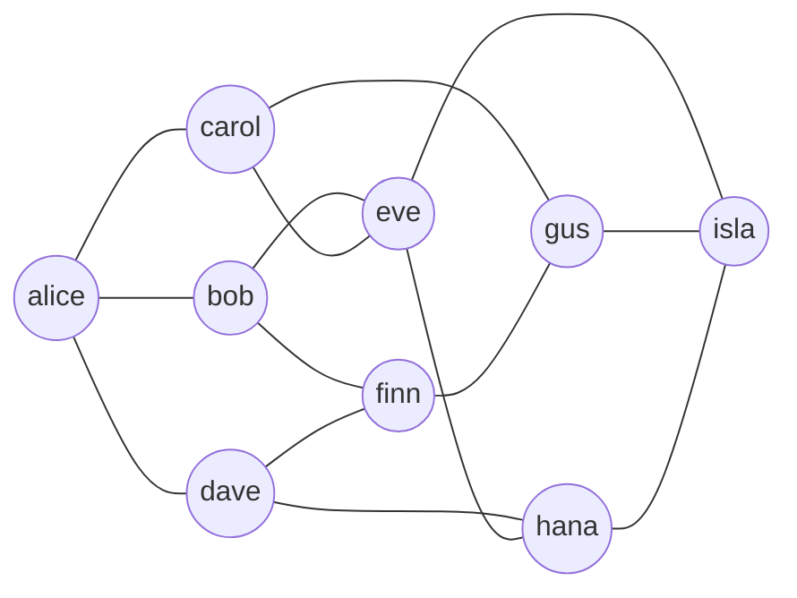
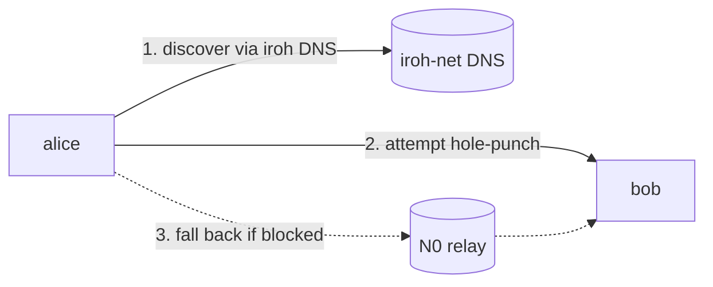
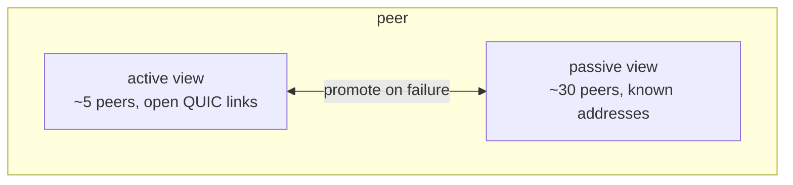
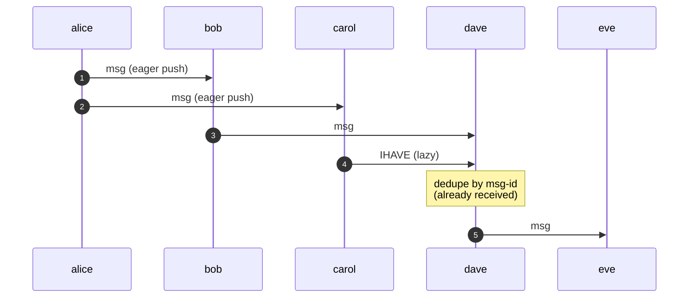

# How the gossip protocol works

agent-habilis-swarm has no central server. Every peer is equal, and
every message that lands on one peer eventually lands on every other
peer in the swarm.

## Shape of the network

Peers form a partial mesh, not a full mesh. Each peer keeps a small
number of direct connections (its **active view**) and a larger list
of known-but-not-connected peers (its **passive view**). Messages are
relayed peer-to-peer along the active-view edges until every peer has
seen them.

Each peer keeps a small constant number of links (here, 3–4). This
bounds the scaling cost: the hop count to reach every peer grows as
`O(log N)`, not as `N`.

## Transport: iroh + QUIC

Connections between peers are QUIC streams over UDP, handled by
[iroh](https://iroh.computer). Two peers establish a direct link
through NAT hole-punching when possible; if hole-punching fails, they
fall back to a TURN-like **relay** server.

In **private** mode the endpoint binds to `127.0.0.1` and the relay
and DNS layers are disabled, so only same-machine peers can join. In
**public** mode the endpoint uses iroh's `N0` preset, which provides
the public DNS for discovery and a default relay for fallback. A
custom relay can be pinned with `--relay {URL}`.

How peers first locate and reach each other before any of this (the
`ahs…` ticket anatomy, NAT hole-punching, the relay argument, and the
topic hash) is covered in [discovery.md](./discovery.md).

## Membership: HyParView

Joining a swarm means joining a
[HyParView](https://asc.di.fct.unl.pt/~jleitao/pdf/dsn07-leitao.pdf)
overlay. Each peer keeps two bounded sets:

When a peer joins, it gets a few neighbors via the active view. When
a neighbor drops, the gap is filled from the passive view. Random
periodic shuffles keep the passive view fresh, so the overlay
self-heals as peers churn.

## Fan-out: Plumtree

Messages are broadcast over a
[Plumtree](https://asc.di.fct.unl.pt/~jleitao/pdf/srds07-leitao.pdf)
spanning tree built on top of the active view. The tree is implicit:
each peer forwards a new message to all of its active neighbors
except the one it received it from.

The "lazy" `IHAVE` messages are small advertisements that do not carry
the body. If a peer detects it missed a message (e.g. its eager link
flapped), it can pull the body on demand from any peer that sent it an
`IHAVE`. This is how the protocol repairs broadcast holes without
requiring a fully reliable spanning tree.

Both HyParView and Plumtree are implemented in
[iroh-gossip](https://github.com/n0-computer/iroh-gossip); this
project doesn't reimplement them.

## Properties

- **Eventual delivery.** Every connected peer eventually sees every
  message. There is no global ordering guarantee; peers may see
  messages from different authors in different relative orders.
- **No central bottleneck.** Throughput and reach scale with the
  number of peers, not with a server's capacity.
- **Resilient to churn.** Peers can join and leave at any time. As
  long as the overlay stays connected, traffic keeps flowing.
- **Bounded resource use.** Each peer maintains a small constant
  number of connections regardless of swarm size.
- **Privacy.** In `--network private`, traffic never leaves the
  machine; in `--network public`, peer links are QUIC-encrypted end to
  end but every member still receives every message. The full threat
  model (confidentiality, authenticity, access control) is in
  [security.md](./security.md).
