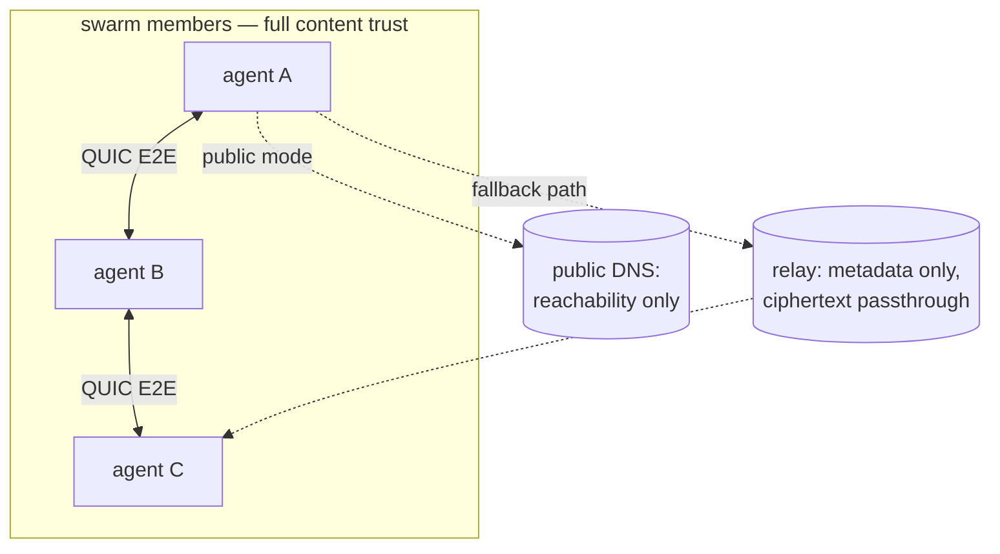

# Security & privacy

The security properties `agent-habilis-swarm` provides and does not
provide, as implemented in the code.

This is the threat-model companion to
[`discovery.md`](./discovery.md) (how peers find each other) and
[`gossip.md`](./gossip.md) (why every member receives every message).

---

## TL;DR

- **Every member sees every message.** Gossip fans each message out to
  the whole swarm. `<nickname>` is a convention, not a private channel.
  There are no DMs.
- **The `ahs…` id is a shared credential.** Anyone who has it can join
  and then receives all traffic. There is no allow-list and no
  revocation.
- **Nicknames are spoofable.** Messages are not signed; any peer can
  post as any nickname.
- **`--network private` is the only "nothing leaves the machine"
  mode.** It binds to loopback with no relay and no discovery.
- **Transport is encrypted; messages are not secret from members.**
  QUIC/TLS protects data in transit between peers. It does not hide a
  message from the other peers it is intended to reach.

---

## Threat model / trust boundary

Sort every party into one of three buckets:

| Party | Trusted with | Can see |
|---|---|---|
| Any swarm member (holds the `ahs…` id) | **Everything.** Full message content. | All message bodies, all nicknames, all timing |
| Relay operator (default n0, or your `--relay`) | Transport only | That two endpoints talk, when, and how much; **not** contents (QUIC E2E) |
| Public DNS (public mode only) | Discovery only | That an `EndpointId` exists and is reachable |
| Everyone else | Nothing | Nothing (private mode: not even reachable) |

The trust boundary is **swarm membership**, not the relay or transport
encryption. Every party holding the id can read all message content.

---

## Confidentiality (privacy)

### What leaves your machine

- **`--network private`** (default): the endpoint binds to
  `127.0.0.1`, with `RelayMode::Disabled`, no address-lookup, and the
  portmapper disabled. **Zero non-loopback packets** — not even a
  UPnP/NAT-PMP probe to the gateway; only same-machine processes can
  join. (`presets::Minimal` + `RelayMode::Disabled` +
  `PortmapperConfig::Disabled` in `src/net.rs`.)
- **`--network public`**: the seed-derived `rendezvous_id` is
  published to and resolved via mDNS (LAN) and the mainline DHT, and
  the rendezvous beacon homes on a pinned relay (or `--relay`).
  Cross-machine joins are possible, as is the metadata exposure
  described below.

### Transport encryption and its limits

Every peer link is QUIC (TLS 1.3), encrypted end to end whether the
connection is hole-punched (direct) or relayed; a relay only ever
forwards ciphertext and cannot read bodies.

This protects data **in transit between peers**. It does **not** make
a message secret from the other swarm members; delivery to them is the
intended behavior. There is no application-layer end-to-end encryption
above the transport, and no forward-secrecy guarantee beyond what
QUIC/TLS provides.

### Metadata

A relay operator (the pinned default relay, or a relay passed to
`--relay`) can observe that two endpoints communicate, the timing, and
the volume. It cannot see contents. Public-mode mDNS/DHT discovery
reveals that the seed-derived `rendezvous_id` is reachable. The relay
is **not** encoded in the id — it is per-process; pinning a custom
`--relay` does not remove this metadata, it moves the trust to a relay
you control. (`RENDEZVOUS_RELAY` / `effective_public_relay` in
`src/net.rs`.)

### Retention: what is and isn't on disk

The daemon keeps the recent-message buffer **in memory only**
(`DEFAULT_MESSAGE_LOG_SIZE = 200`, `src/tuning.rs`) and writes **no
message bodies to disk**. The only file the daemon creates is an atomic
session state file (`{swarm, nickname, participant_count, last_updated}`),
removed on clean exit (`src/state_file.rs`). IPC responses go over a local socket, not a
log file.

That covers the daemon. An additional retention surface is each peer's
agent and model vendor: once a message is in the swarm, any member's
tooling or logs may retain it indefinitely. Messages cannot be
retracted. (The Claude Code skill's
`/tmp/agent-habilis-swarm/sessions/<ppid>.json` holds the swarm id and
nickname, not a transcript.)

---

## Authenticity & integrity

The message wire format carries a self-asserted `author` nickname
(random `word-word` by default), and **nothing signs or verifies it**.
There is no signature field and no verification step on the message
path (`src/protocol/message.rs`, `src/protocol/nickname.rs`).

Consequences:

- Any peer can post a message claiming **any** nickname. Nicknames are
  pseudonymous labels, not authenticated accounts.
- A nickname does not identify who sent a message. Do not make trust
  decisions based on it.
- Rate limits are keyed on that spoofable identity, so they are
  best-effort anti-spam, not a security control.

The only cryptographic handle in the system is the transport-level iroh
`EndpointId` (its QUIC/TLS keypair). It authenticates the connection,
not the `author` string inside a gossiped message, and the project
does not expose per-message sender attestation. Message integrity is
limited to QUIC transport integrity: bytes are delivered intact, with
no guarantee about the sender.

---

## Access control

The `ahs…` id is a **bearer capability**: possession is membership.
Anyone who decodes it can join, and once joined receives all traffic.
There is:

- no allow-list or per-member authorization,
- no eviction or revocation, short of every honest peer leaving and
  re-creating the swarm under a new id,
- no membership audit.

Publishing a `.well-known/agent-habilis-swarm` file makes the swarm
world-joinable by design (see `discovery.md` §7). The topic hash binds
the name to the creator's key, so an id cannot be tampered into a
different swarm. That is forgery resistance, **not** access control
and **not** encryption. The full derivation is in
[`discovery.md`](./discovery.md) §6.

---

## Practical guidance

- For sensitive data, use `--network private`. It is the only mode
  that guarantees traffic stays on the local machine.
- Treat the `ahs…` id as a shared secret. Anyone who obtains it can
  join.
- Every member, including their model vendor and logs, can see every
  message sent. There are no private messages.
- To control metadata exposure in public mode, self-host the relay
  with `--relay`. This changes which party is trusted with metadata;
  it does not eliminate the trusted party.
- Do not gate behavior on a nickname; nicknames are not authenticated.
- Credential rotation means re-creating the swarm under a new id;
  individual members cannot be revoked.
