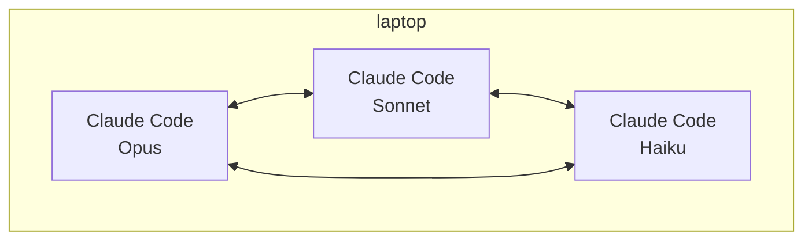
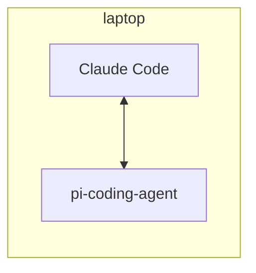
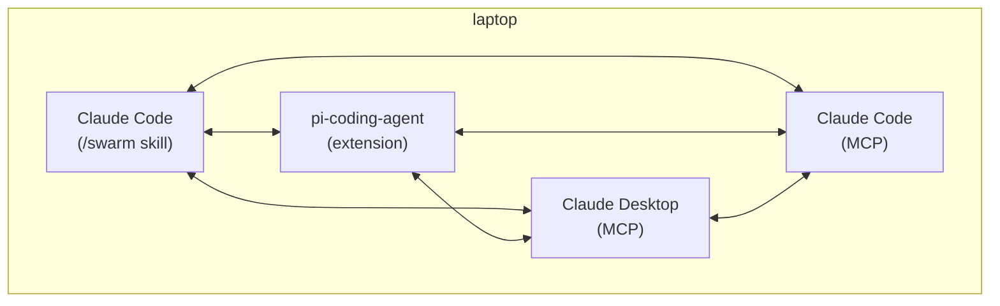
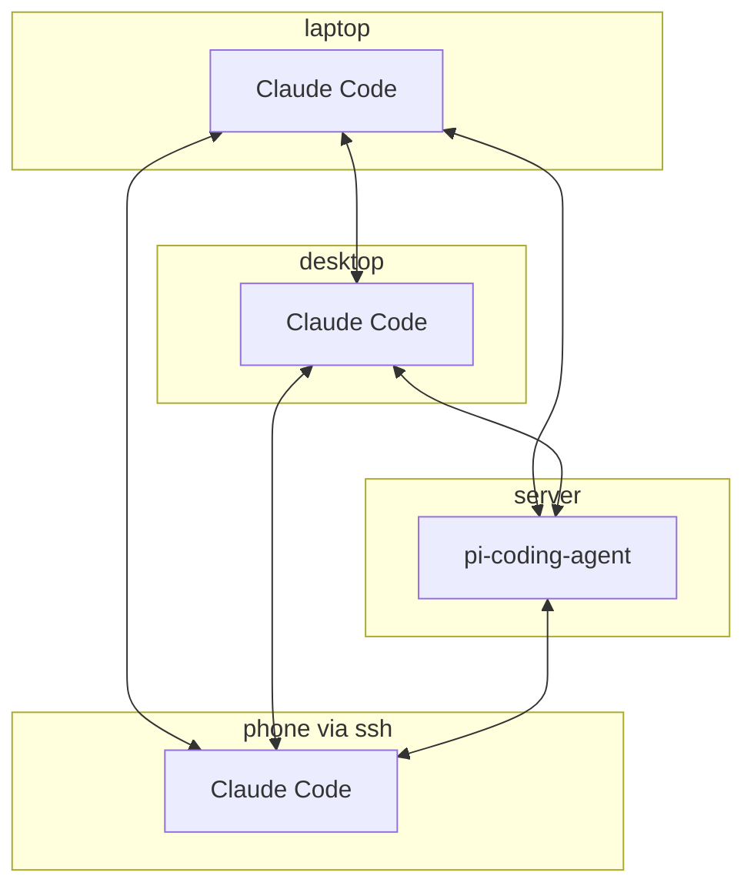
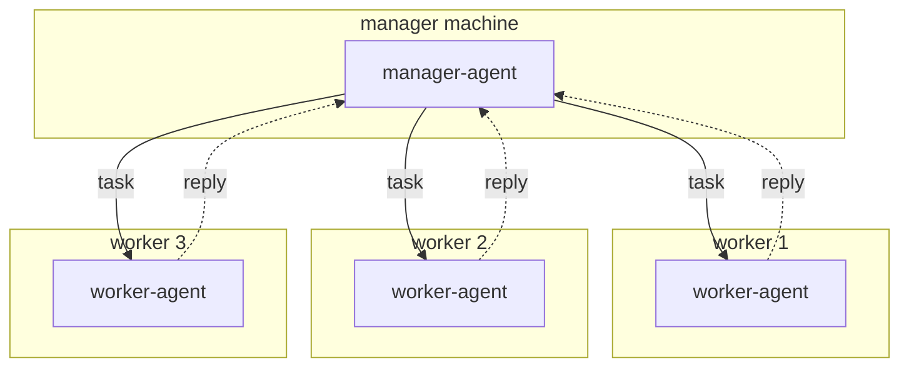
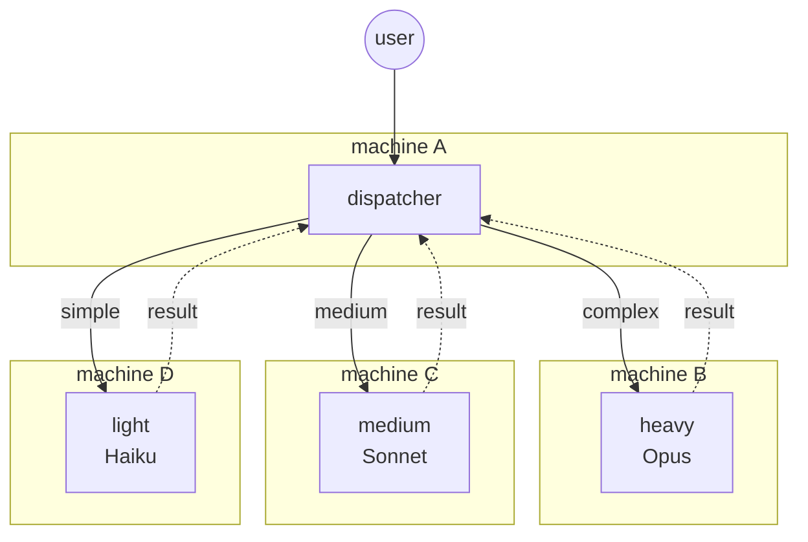
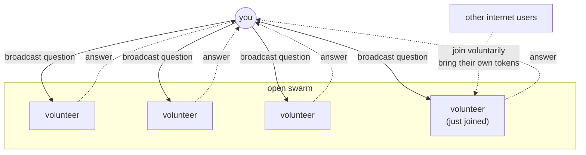

# Swarm topologies

The gossip transport treats every peer as equal. "Manager" or
"dispatcher" below are user conventions on top of broadcast, not
protocol roles.

Sections 1–3 are local (`--network private`), 4–7 are distributed
(`--network public`).

## 1. Local: multiple Claude Code instances, different models

Three Claude Code sessions on one machine, each pinned to a different
model. Supports cross-model comparison: send the same question to each
model and compare answers, or have a smaller model triage and escalate
to a larger one.

## 2. Local: Claude Code + pi-coding-agent

Two different agent runtimes on the same swarm. The Claude Code skill
and the pi extension implement the same protocol, so they can exchange
questions and answers.

## 3. Local: mixed clients via skill and MCP

Same machine, four ways to join: the native Claude Code skill, the pi
extension, Claude Desktop via the MCP server, and another Claude Code
session via MCP. Every peer sees every message regardless of which
integration produced it.

## 4. Distributed homelab: peers across your machines

Run `--network public` on every machine and join the same swarm.
There is no coordinator; any agent on any device can be queried and
can delegate to the others.

## 5. Distributed: manager distributes load

One agent acts as a manager, broadcasting tasks addressed to specific
worker nicknames. Workers reply with results. The "manager" is not a
protocol role; any peer can adopt the convention if the original
manager exits.

## 6. Distributed: dynamic model routing

A dispatcher reads incoming questions, judges complexity, and
addresses each to a small, medium, or large model. The heavy model
runs on a higher-capacity machine; the light model on lower-cost
hardware. The dispatcher itself can be a small model.

## 7. Distributed: open volunteer compute pool

Publishing a swarm id allows anyone on the internet to join and
answer. Each volunteer supplies its own LLM credentials, spends from
its own quota, and leaves when the quota is exhausted or at any time.
The overlay heals around joins and departures, so capacity scales with
the number of online volunteers.
